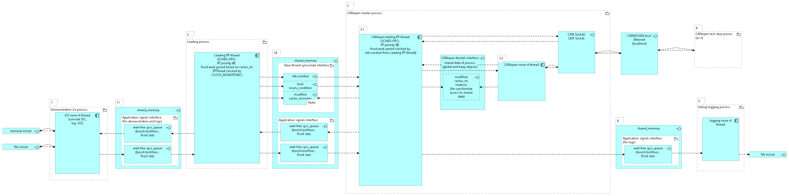

# Архитектура системного уровня ПО блока

## Build

    Необходимое условие - текущий каталог lesson_individual, собираем в нём так:
    
    Конфигурируем сборку приложения canapp:

    cmake -Bbuild . 

    cd canopenmaster
    
    Конфигурируем сборку библиотеки libccanopenmaster.so (в репозитории приведена пробная заглушка и пробный публичный h-файл библиотеки с базовыми типами функций, которые будут реализованы в библиотеке аналогично, но в большем количестве...):
        
    cmake -Bbuild . 
    
    cd build/

    #собираем и копируем полученную библиотеку libccanopenmaster.so в каталог сборки приложения canapp (необходимое условие для сборки приложения)

    cmake --build . && cp libccanopenmaster.so ../../build/

    cd ../..

    cmake --build build

## Run

    cd build/

    ./canapp test test

    В консоли должен появиться следующий текст:
        
        canopen.testLibFun() == 1
        
        canopen.event1_ring_buffer.pop() == 5
        
        canopen.event1_ring_buffer.pop() == 6
        
        canopen.event1_ring_buffer.pop() == 7
        
        canopen.event1_ring_buffer.pop() == 8
        
        canopen.event1_ring_buffer.pop() == 9
        
        canopen.event1_ring_buffer.pop() == 10
        
        canopen.event1_ring_buffer.pop() == 11
        
        canopen.event1_ring_buffer.pop() == 12
        
        canopen.event1_ring_buffer.pop() == 13
        
        canopen.event1_ring_buffer.pop() == 14
        
        NetworkIniFileName=test, CANopenMasterLibFileName=test

## Test of dynamic lynking

    В файле ccanopenmaster.cpp в строчке "const uint32_t MAX_EMULATE_EVENT1_N = " изменить значение константы на желаемое не превышая максимального размера очереди и пересобрать и скопировать so в папку с артефактом canapp командой:
    
    cd canopenmaster/build && cmake --build . && cp libccanopenmaster.so ../../build/ && cd ../../build

    Далее запустить canapp командой:

    ./canapp test test

    В результате количество выводимых в консоль строчек должно соответсвовать новому значению MAX_EMULATE_EVENT1_N.

## Краткое описание данного этапа работ и TODO

добавил класс-заглушку, реализующий упрощённый пока итерфейс CANopen библиотеки (публичный интерфейс библиотеки ccanopenmaster.h). В методе CCANopenMaster::testLibRealTimeTask(...) вызывается "прототип" функции-callback библиотеки testLibCallBack1()(таких в библиотеке реально много, просто над ними я должен потом написать обёртки C++). В функции testLibCallBack1() происходит wait-free запись в очередь boost::lockfree::spsc_queue статического размера (из сети CAN могут приходить различные сообщения о нештатных событиях, сбоях и данные события могут повторяться, а обработать нужно все события, хоть и неспешно, не тормозя при этом периодическое выполнение CCANopenMaster::testLibRealTimeTask(...) в реальном времени). Собитие testLibCallBack1() я пока просто эмулирую прямо в коде для демонстрационных целей - на каждом периоде данное событие вызывается ~MAX_EMULATE_EVENT1_N раз. Далее после выполнения canopen.testLibRealTimeTask() (см canapp.cpp) очередь заполнена событиями соответственно количеству MAX_EMULATE_EVENT1_N. Для демонстрации в цикле вычитываем эту очередь далее и выводим все поступившие в очередь события в консоль. Следующим этапом, планирую CCANopenMaster::testLibRealTimeTask(...) вынести в отдельный поток cactus_rt (SCHEDFIFO, чёткий периодический вызовtest LibRealTimeTask()). Таким образом получится, что очередь наполняется событиями в потоке RT, а вычитка поступивших в очередь событий будет в происходить в другом потоке. А следующим этапом сделаю тактирование RT-потока не по собственным часам CLOCK_MONOTONIC, а специально разработанным приложением, тактирующим canapp условной переменной. Далее TODO... влоть до внедрения подсистемы конфигурирования.

## Описание
Программный комплекс состоит из нескольких процессов, приведённых ниже. Данные процессы запускаются на выполнение каждый из своего файла соответственно. В составе каждого процесса исполняется один или более потоков с различными политиками поанирования, описываемыми ниже по тексту. Биение на процессы в некоторой степени обеспечивает независимость работы одного процесса от другого, что повышает работоспособность процессов по отдельности. Биение на процесс см. п.п. "Описание процессов". В то же время непосредственное исполнение программных функций и взаимодействие между процессами осуществляестя именно на уровне потоков, в том числе потоков находящися в разных процессах. Поэтому в п. "Описание потоков" приведено укрупнённое описание архитектуры всех потоков и используемых IPC.

## Описание процессов
Процессы 2 и 3 представляют из себя прототипы процессов для управления транспортным средством на целевом вычислителе с многоядерным процессором архитектуры Arm64. 

Процессы 1, 4, 5 необходимы для демонстрационных целей и отладки.

Более подробное описание каждого процесса приведено ниже:
1. Процесс 1 необходим для демострационного ввода-вывода данных в комплекс с целью обмена данными с процессом 4 (CANopen test slave process) и для отладки, например для возможности анализа характеристик реального времени потоков реального времени процесса 2 (Ведущий процесс).
1. Процесс 2 является прототипом процесса, выполняющего функции:
    - исполнения алгоритмов управления с фиксированной периодичностью управления по данным полученным извне, зараннее определённой в конфигурационном файле
    - ведущего REALTIME-процесса, т.е. процесса, генерирующего синхронизационные "сигналы" REALTIME-процессам комплекса (в данном "сигнал" посредством механизма условной переменной передаётся в процесс 3)
    Процесс 2 имеет в своём составе как минимум 1 Realtime-поток.
1. Процесс 3 - это прототип процесса CANopen мастера, обеспечивающего ввод/вывод данных процесса 2 по протоколу CANopen с внешних интерфейсов CAN или UDP.
Процесс 3 имеет в своём составе как минимум 1 Realtime-поток, выполняющий C-функции библиотеки CANopen циклически в реальном времени.
1. Процесс 4 представляет из программу, реализующую простой тестовый слейв CANopen, взаимодействующий с CANopen мастером через CAN/UDP.
1. Процесс 5 необходим для отладки, например для возможности анализа характеристик реального времени потоков реального времени процесса 3 (CANopen мастер). 

## Описание потоков

Realtime-потоки процессов 2 и 3 вместе с внешими процессами/устройствами, подключенным к CAN/VCAN шине или Ethernet/Localhost образуют контур управления с периодичностью, указываемой в конфигурационном файле. 

В состав разрабатываемого ПО входит набор realtime-потоков, которые должны исполняться в определённом порядке друг по отношению к другу детерминированно (при условии соблюдения данных требований так же самой ОС и процессором). В тоже время в общем случае изредко допустима некоторая рассинхронизация исполнения потоков, которая не должна приводить к неоправданно длительной блокировке realtime-потоков и тем более не должна приводить к взаимной блокировке realtime-потоков. Другими словами в целом два realtime-потока должны работать синхронно по часам (CLOCK_MONOTONIC) и при этом успевать выполнять свои задачи за каждый период контура управления СУ (детерминированно), но при этом изредка допустимы "залипания" какого-либо из потоков на некоторое количество тактов с дальнейшим восстановлением работы и без остановки работы другого потока (устойчивость к "залипанию" потока). В норме ОС должна обеспечить минимизацию или полное отсутвие данного залипания, но с учётом того что разрабатываемый исходный код может применяться на разных имплементациях Linux и различными требованиями детерминированности поведения ОС, то в общем случае при передаче данных между потоками должна быть допустима рассинхронизация, не преводящая к неисправности программы. 

Для обеспечения указанных выше требований для периодической передачи больших срезов данных между realtime-процессами был выбран механизм очереди с обним производителем и одним потребителем (и конкретная wait-free реализация данной очереди boost::lock_free::spsc_queue с заранее аллоцированным фиксированным размером используемой под очередь память и без применения средств синхронизации ОС). Таким образом в случае залипания какого-либо из real-time потоков в момент копирования данных в очередь, другой поток продолжит работу безблокировочно в течении некоторого времени. Механизм очереди избыточнен по сравнению с доступом realtime-потоков к общему буфферу в критической секции кода, но с другой сторгоны очередь повышает безотказность работы realtime-потоков ввиду уменьшения размера критической секции или её полного отсутвия (как в случае с boost::lock_free::spsc_queue).

Для обеспечения синхронного старта выполнения задач каждого realtime-потока друг по отношению к другу на каждой новой итерации в текущей реализации применён следующий механизм: "ведущий" realtime-поток 2 (Leading RT-thread) обеспечивает периодическое выполнение своих задач по часам CLOCK_MONOTONIC, в то время как "ведомые" realtime-потоки  (в данном случае только один realtime-поток 3.1 CANopen trailing) начинаю выполнение своих задач по команде от "ведущего", получаемой через механизм условной переменной. С учётом того, что механизм условной переменной обязательно должен использовать мьютекс, то применённый механизм не гарантирует отстувие блокировок, и в дальнейшем планируется рассмотерть возможность работы каждого realtime-потока полностью независимо от взаимных блокировок (например работа каждого по часам CLOCK_MONOTONIC либо иные механизмы синхронизации, доступные на применяемой платформе).

Ниже приведена временная диаграмма, описывающая то, как Realtime-потоки 2 и 3.1 должны быть синхронизированы во времени. На данной диаграмме показаны 2 возможных случая исполнения указанных потоков: случай, когда ОС обеспечивает исполнение потоков в режиме HARD-REALTIME (без недетерминированных просрочек сроков исполнения), и случай, когда ОС обеспечивает только SOFT-REALTIME (но при этом ПО остаётся работоспособным за счёт применения очереди без ожидания при передаче данных между потоками и применения при синхронизации realtime-потоков мьютексами в режимах PTHREAD_MUTEX_RECURSIVE и PTHREAD_MUTEX_ROBUST+PTHREAD_PROCESS_SHARED для случая синхронизации потоков разных процессов).

Realtime-потоки 2 и 3.1 (Leading RT-thread и CANopen trailing RT-thread) исполняются с политикой планировщика SCHED-FIFO и изолируются каждый на своём ядре процессора с помощью использования средств библиотеки Cactus_rt, обеспечивающей соответвующие С++ обёртки над стандартными C-функциями POSIX и Linux. Т.е. в данном случае выбран способ указания политик планировщика и особенностей изоляции REALTIME-потоков с помощью функций, встроенных исходный код разрабатываемых программ C++, а не с помощью средств администрирования ОС.

